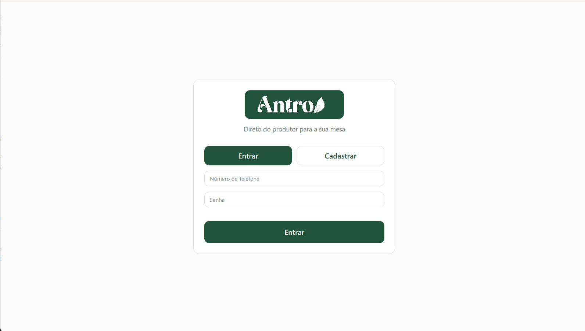
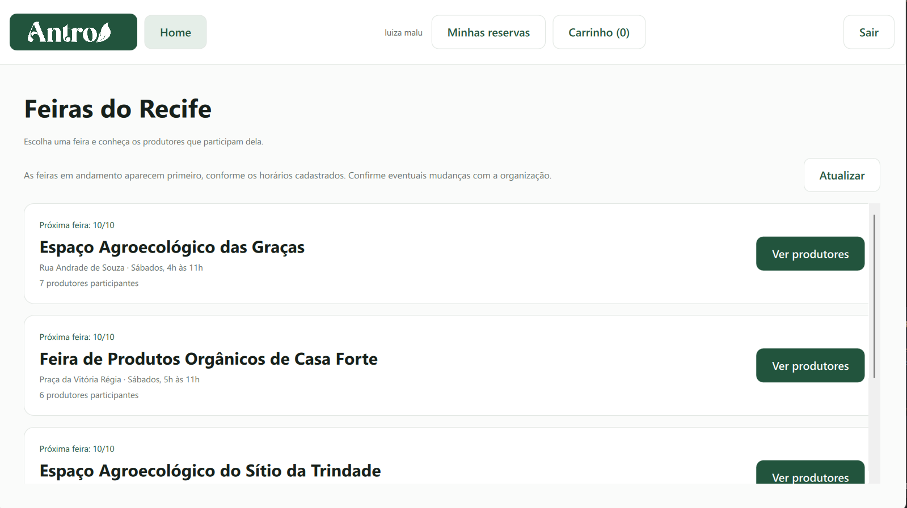
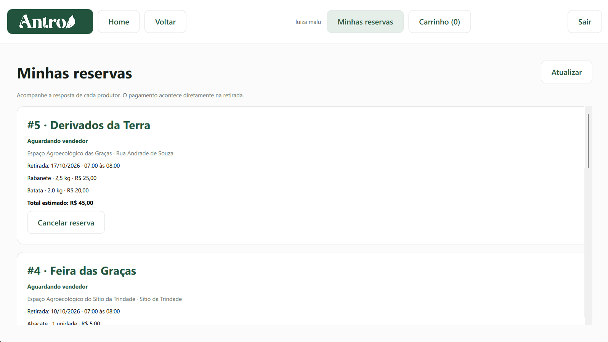
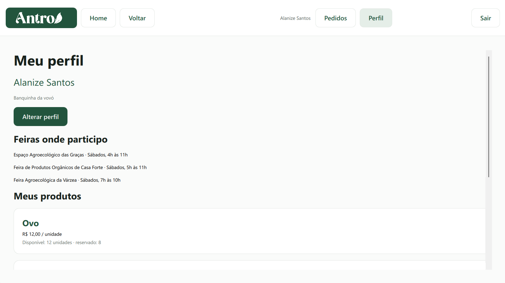
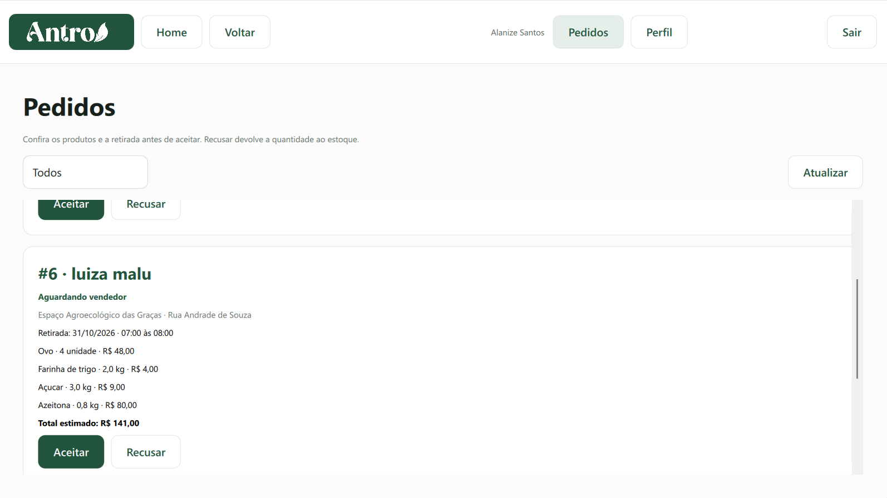

# Antro


Aplicativo desenvolvido pela **Equipe 7**, para a disciplina de Estruturas de Dados e Orientação a Objetos do CIn UFPE. O projeto aproxima pequenos produtores agroecológicos e compradores das feiras do Recife. A proposta é facilitar a consulta dos produtos disponíveis e organizar reservas para retirada presencial, permitindo que o feirante acompanhe a demanda e administre sua banca.

## Funcionalidades

- **Comprador:** consulta feiras e produtores, adiciona produtos à sacola, agenda a retirada e acompanha suas reservas.
- **Feirante:** seleciona as feiras em que participa, cadastra produtos, define preços e estoque e gerencia os pedidos recebidos.
- **Contas:** cadastro e login nos dois perfis, com armazenamento local em SQLite.

O comprador escolhe uma feira, acessa uma banca e adiciona os produtos à sacola. Depois, seleciona a data e o horário de retirada e envia a reserva. O feirante recebe o pedido e pode aceitá-lo ou recusá-lo; o comprador acompanha a resposta na sua área de reservas.

O estoque é descontado ao registrar a solicitação e devolvido em caso de recusa ou cancelamento. Os produtos de uma banca compartilham o mesmo estoque entre as feiras em que são oferecidos.

O pagamento é combinado diretamente entre comprador e produtor, fora do aplicativo.

## Interface

### Login e cadastro

A tela de entrada permite acessar uma conta usando telefone e senha ou iniciar um cadastro. O usuário escolhe entre comprador e feirante; para o feirante, também são solicitados o nome da banca e a identificação OCS.



### Feiras do comprador

Apresenta as feiras cadastradas, com local, dia de funcionamento, próxima data e quantidade de produtores participantes. As feiras em andamento aparecem primeiro. O botão “Ver produtores” leva às bancas da feira escolhida, de onde o comprador acessa os produtos e monta sua sacola.



### Reservas do comprador

Reúne as reservas realizadas, indicando a banca, a feira, os produtos, as quantidades, o valor estimado e a data e o horário de retirada. O comprador acompanha a resposta do feirante e pode cancelar conforme a situação da reserva. O valor final é combinado na retirada, especialmente para produtos vendidos por peso.



### Perfil do feirante

Mostra o nome do feirante, sua banca, as feiras em que participa e os produtos cadastrados. Cada produto apresenta preço e estoque disponível e reservado. Pela opção “Alterar perfil”, o feirante acessa a edição das informações da banca, da participação nas feiras e dos produtos.



### Pedidos recebidos

Permite ao feirante consultar as solicitações dos compradores e conferir os itens, o valor estimado e o agendamento da retirada. Há opções para filtrar os pedidos e aceitar ou recusar as solicitações. Recusar devolve os itens ao estoque; nos pedidos aceitos, o feirante pode registrar a retirada a partir do início do horário agendado.



## Tecnologias

A lógica do aplicativo foi desenvolvida em **C++17**, e a interface utiliza **Qt Quick e QML**. O **Qt SQL** faz a comunicação com o banco **SQLite**, enquanto o **CMake** configura a compilação. O repositório também possui testes automatizados para catálogo, persistência e integração das telas.

## Como executar

1. Clone o repositório:

   ```bash
   git clone https://github.com/joaobgdev/Antro.git
   ```

2. Abra o arquivo `CMakeLists.txt` no Qt Creator.
3. Selecione um kit Desktop com Qt 6.5 ou superior e os módulos Qt Quick e Qt SQL.
4. Compile e execute o alvo `appAntro`.

Os dados são salvos localmente no arquivo `antro.db`, criado na pasta de dados do aplicativo. A versão atual não sincroniza dados entre dispositivos.

## Documentação

Consulte a [documentação do projeto em PDF](docs/Documentacao-Antro.pdf) para conhecer os fluxos, a arquitetura, as classes e o histórico do desenvolvimento.

## Equipe 7

- Lucas Medrado Santos
- João Bernardo Gomes Alves de Carvalho
- Maria Luiza de Paula Portela
- Luis Eduardo Lustosa Brito
